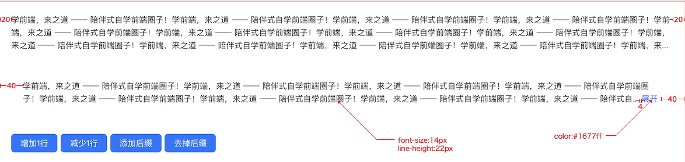

# `[P7-s1]` Paragraph 段落组件-原生JS版

## 项目简介

### 项目介绍

按照设计稿和组件说明，使用原生 JavaScript 实现 Paragraph 组件

### 组件说明

- 支持段落文本的展开/收起功能
- 支持自定义省略内容后缀功能
- 支持动态变更显示行数功能
- 能够正确应对页面视窗 `resize` 行为对组件内容的影响

### 设计稿说明

- 页面有两段长文本，内容是一样的，都是【学前端，来之道 —— 陪伴式自学前端圈子！】重复 20 次。
- 第一段文本只显示 3 行，其他内容省略
- 第二段文本只显示 2 行，其他内容省略，但是它拥有`展开`和`收起`功能。
- 页面底下有一排按钮，它们是用来控制第二段文本的，你可以把你在 [[P6] Button 按钮组件](https://github.com/ZhiDaoFE/P6-button-component) 项目中实现的 Button 组件拿过来直接使用哈，这些按钮的功能从左到右分别是：
  - 【增加1行】按钮：点击之后，让第二段文本的内容多展示 1 行
  - 【减少1行】按钮：点击之后，让第二段文本的内容少展示 1 行，至少要展示 1 行文本
  - 【添加后缀】按钮：点击之后，让第二段文本的内容添加一个文本后缀【 -- 之道前端】
  - 【去掉后缀】按钮：点击之后，把文本后缀去掉

- 要求：当文本元素的宽度发生变更时，Paragraph 段落组件的文本内容可以被正确展示，比如时刻保持最多显示 3 行的文本内容，其他内容省略。（你可以通过拖拽浏览器窗口宽度来改变文本元素的宽度~）

> [在线体验](https://zhidaofe.github.io/P7-paragraph-component/s1/index.html)

### 项目要求

- 先按照设计稿和组件说明，实现组件代码。然后在页面中使用你实现的组件来达到题目要求
- 保证最终实现的页面完全复现设计稿，真实的工作中，火眼金睛的设计师 1 px 的差异都能找到，不要心存侥幸
- **先按照设计稿和组件说明真得去开发，不要看参考答案！**，也不要去看业界和开源的组件库代码
- 本项目组件的核心逻辑是通过 JavaScript 来实现文本省略，具体要怎么做呢？请先自己思考和琢磨，等实在没办法了，再从网上查找思路，然后再通过编码去实现这个思路
- 如果开发过程中碰到问题，不知道怎么实现的话，去网上查找答案，不要去看答案！在真实的工作中，你不会有参考答案的，你只能自己想办法找到问题的解决方案
- 记录你的疑问，比如：
  - 有个很难实现的地方，总感觉自己实现的方案不是最优方案，还有更好的方案
  - 不知道自己的实现方案到底好不好
  - 完成开发之后，再整体 review 一遍自己的代码，觉得还有哪些地方是不够好的

- 带着你的疑问，再去查看参考答案或者开源组件库去寻找答案，如果还是没有得到解答，请来 [**之道前端**](https://kcnrozgf41zs.feishu.cn/wiki/PBj0w5rjUiEWVgktZE0caKOunNc) 提问

### 练习本项目你会收获什么？

- 提升原生 JavaScript 的编码熟练度
- 学会正确使用原生 JavaScript 操作 Dom
- 学会正确使用原生 JavaScript 操作 Dom 元素的样式
- 学会正确使用原生 JavaScript 处理 DOM 事件
- 学会如何封装一个组件
- 【进阶】深刻理解什么是好的组件
- 【进阶】积累封装组件的经验
- 【进阶】逐渐形成自己的 JavaScript 代码风格

> 如果只实践一次，那就只会有基础收获
>
> 只有不断练习、思考、优化，才会有进阶收获

### 本项目适合的同学

- 处于 L2 水平的同学
- 对原生 JavaScript 还不熟练的同学
- 没怎么封装过 UI 组件的同学
- 没怎么写过 C 端页面，大部分时间在做 admin 系统的同学
- 只会开发 React/Vue 组件，想要练习如何封装原生 JavaScript 组件的同学

## 开始练习

我们针对不同经验的同学提供了相应的[练习指引手册](https://kcnrozgf41zs.feishu.cn/wiki/An7GwvUQrirdvdkJdQ9c4q3Rndd)，你可以按照这个指引手册来练习本项目。

